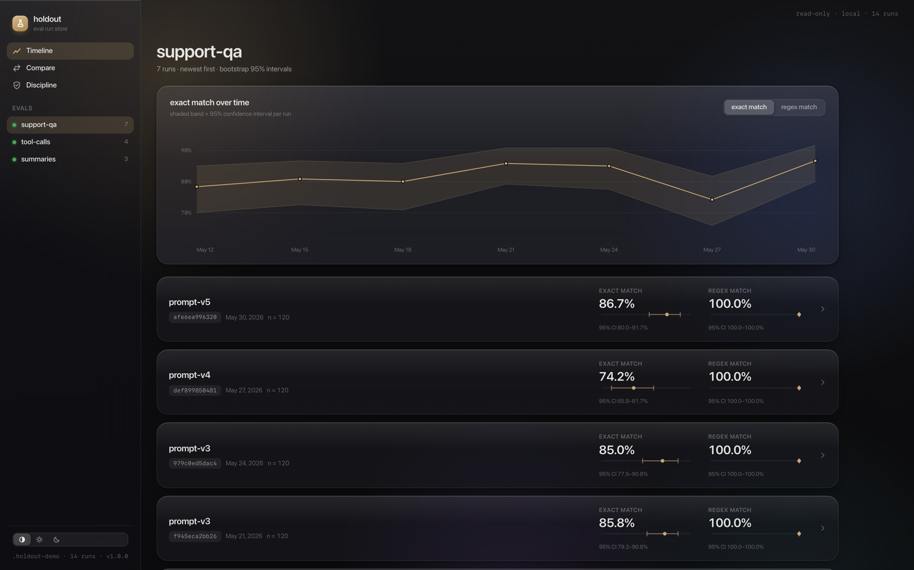

# holdout

**The LLM eval framework that reports a confidence interval, not a vanity number.**



*One command — `holdout dashboard` — serves this over your local run store. Read-only, fully offline, 0 bytes leave the machine.*

You changed a prompt. Your eval score moved from 0.967 to 0.933. Do you ship?

Every threshold-based eval tool answers that question wrong in both directions: it
fails your build on noise, and it waves through real regressions that hide inside the
noise band. `holdout` answers it the way a quant desk would — with a paired
significance test, a confidence interval, and a verdict you can stake a deploy on.

```python
from holdout import run
from holdout.testing import assert_no_regression

baseline  = run(support_qa, target=Anthropic("claude-sonnet-4-6", system=PROMPT_V1), seed=7)
candidate = run(support_qa, target=Anthropic("claude-sonnet-4-6", system=PROMPT_V2), seed=7)

assert_no_regression(baseline, candidate, alpha=0.05)
# AssertionError: regression detected on: exact_match
#   exact_match  REGRESSED  Δ=-0.200  [95% CI -0.317, -0.117]  mcnemar-exact
#   p=0.0005 (benjamini-hochberg-adjusted)  n=60
```

The same gate stays green when the same eval wobbles 0.967 → 0.933 by chance
(`p=0.5`) — run [examples/02_regression_gate.py](examples/02_regression_gate.py)
and watch it do both, offline, in two seconds.

## Why another eval tool?

| | promptfoo | deepeval | ragas | LangSmith | **holdout** |
|---|---|---|---|---|---|
| Score output | point estimates | point estimates | point estimates | point estimates | **estimate + CI, always** |
| Significance testing | no | no | no | no | **paired bootstrap, exact McNemar, permutation** |
| Multiple-comparison correction | no | no | no | no | **Benjamini-Hochberg / Holm** |
| "Is my eval big enough?" | no | no | no | no | **power / minimum-detectable-effect** |
| Leakage & holdout discipline | no | no | no | no | **contamination, near-dupes, reuse ledger** |
| Local / air-gapped | partial | partial | partial | no (hosted) | **first-class: Ollama, Apple MLX, 0 bytes out** |
| CI regression gate | threshold | threshold | no | hosted | **statistical verdict, exit-code native** |

These are good tools; they answer "what's my score?" `holdout` answers a different
question — *did quality actually change, or am I being fooled by noise?* — and
refuses to answer it dishonestly. There is no API in this library that returns an
aggregate metric without its uncertainty.

## Quickstart

```console
pip install holdout            # extras: holdout[openai] holdout[anthropic] holdout[mlx]
```

```python
from holdout import Case, Eval, run
from holdout.providers import Ollama
from holdout.scorers import ExactMatch

qa = Eval("smoke", [Case(input="2+2?", reference="4"), ...], [ExactMatch()])
result = run(qa, target=Ollama("llama3.2"), seed=7)
print(result.summary())
# smoke  n=200  target=ollama:llama3.2  run=9466016bb630
#   exact_match  0.840 [95% CI 0.785, 0.890] (n=200, bootstrap-bca)
```

Same seed + same inputs ⇒ identical run hash — runs are content-addressed,
reproducible, and diffable. `holdout compare <runA> <runB>` from the CLI prints the
verdict table and exits 1 only on a statistically significant regression.

## Gate your CI

```yaml
# .github/workflows/evals.yml
name: evals
on: pull_request
permissions: { contents: read, pull-requests: write }
jobs:
  eval-gate:
    runs-on: ubuntu-latest
    steps:
      - uses: actions/checkout@v4
      - uses: roshworldwide/project1@v1
        with:
          eval: evals/cases.jsonl
          target: "anthropic:claude-sonnet-4-6"
          baseline: <baseline-run-id>      # committed run artifact in your store
          store: evals/store
        env:
          ANTHROPIC_API_KEY: ${{ secrets.ANTHROPIC_API_KEY }}
```

The action runs your eval on the PR, compares it against the baseline with paired
tests and corrected p-values, posts the comparison table as a PR comment, and fails
the check only when quality regressed beyond noise. This repository gates itself
with this exact action on every PR.

## Local-first / air-gapped

Cloud providers are optional extras, not assumptions. The core, the Ollama and
Apple-MLX providers, the embedding scorer, the run store, and the HTML report all
work with zero bytes leaving the machine — a real requirement for regulated teams,
and the default posture of this tool.

```console
python examples/04_ollama_airgapped.py    # local Ollama
python examples/05_mlx_airgapped.py       # in-process on Apple silicon
```

## What else is in the box

- **pytest plugin** — `assert_no_regression`, `assert_significant_improvement`,
  `assert_adequately_powered`, `assert_no_leakage`, the `@llm_eval` decorator, and a
  marker so fast CI lanes can skip real model calls.
- **Leakage detection** — finds eval cases hiding in your prompt/few-shots
  (word-boundary exact + n-gram containment + optional embeddings), near-duplicate
  cases that inflate your effective n, and a ledger that counts how many times you
  have tuned against the same eval set — adaptive reuse is how teams quietly overfit
  their own benchmark.
- **Power analysis** — `holdout power --n 200 --p01 0.05 --p10 0.05` tells you the
  smallest effect your eval can detect. A "no significant change" from an
  underpowered eval is not evidence of safety, and this tool says so.
- **HTML report** — one self-contained dark file, every metric drawn with its CI as
  an error bar. Opens on an air-gapped machine.
- **Local dashboard** — `holdout dashboard` serves a read-only web UI over the run
  store: runs timeline, trend charts with CI bands, statistical comparisons with
  paired error bars, and holdout-discipline status. The SPA ships inside the wheel;
  no Node, no cloud, no accounts.
- **Performance** — the framework adds ~6 µs per case; a 1,000-case eval runs at
  1.08× the theoretical I/O floor ([measured](benchmarks/RESULTS.md), rerun it
  yourself).

## What this is not

- Not a hosted service. No accounts, no telemetry, no data leaves your machine.
- Not a prompt optimizer. Auto-tuning against your eval set is precisely the
  overfitting this tool exists to detect.
- Not an observability/tracing platform — promptfoo and LangSmith do that well.
- No fabricated numbers. Everything in [benchmarks/](benchmarks/) is measured;
  every statistical method cites its source in the docstring.

## How the statistics work

BCa bootstrap intervals (Efron 1987), paired shifted-null bootstrap and exact
McNemar tests, sign-flip permutation, Phipson-Smyth p-values that can never be
zero, Benjamini-Hochberg correction, and normal-approximation power analysis —
each implemented to be checkable against its citation and verified by simulation
(coverage, type-I error, power calibration, realized FDR).
The full walkthrough: [docs/guide/statistics.md](docs/guide/statistics.md).

## License

MIT.
